### Creacion de la maquina virtual de Windows
### Maquina #1 (Sin interfaz)
**- Inicamos con una configuracion basica, colocandole su respectivo nombre**

**-Le configuramos un tamaño basico para la ram**

**-Le asignamos 15GB de almacenamiento**

**-Configuramos la red:**

**- Podemos seleccionar el teclado en español colombia**

**- En este caso como se quiere instalar sin interfaz grafica, seleccionamos la version Standard**

**- Aceptamos los terminos**

**- Elegimos la instalacon personalizada**

**- Seleccionamos el disoc recien creado**

**- Esperamos un rato a que instale**

**- Seleccionamos ok para asignarle una contraseña**

**- Digitamos una contraseña "root1234" y le damos ENTER"**

**- Esperamos que inicie**

**- Iniciamos la configuracion de network, por lo cual elegimos la opcion 8**

**- Seleccionamos la opcion 1**

**- Nuevamenete seleccionamos la opcion 1 para configurar la red**

**- Ponemos un "S"**

**- Se escribe la IP dada por el laboratorio**

**- Escribimos la mascara tambien dada por el laboratorio**

**- Y escribimos el "Gateway"**

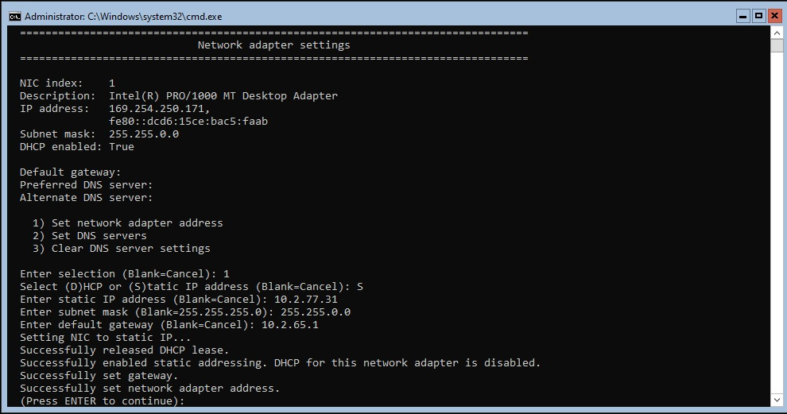

**- Luego de darle enter inresamos nuevamente al menu seleccionando la opcion 8**

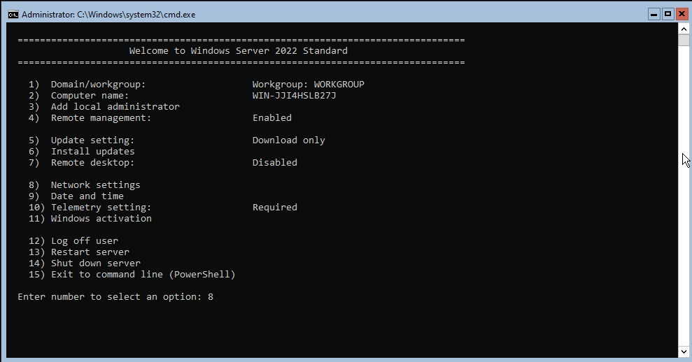

**- Ingresamos a la configuracion de DNS**

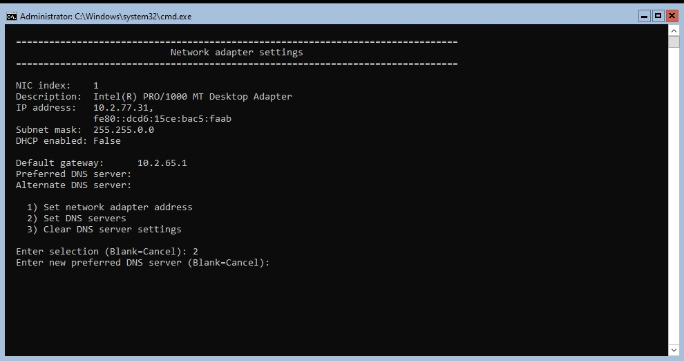

**- Ingresamos el DNS dado por la guia**

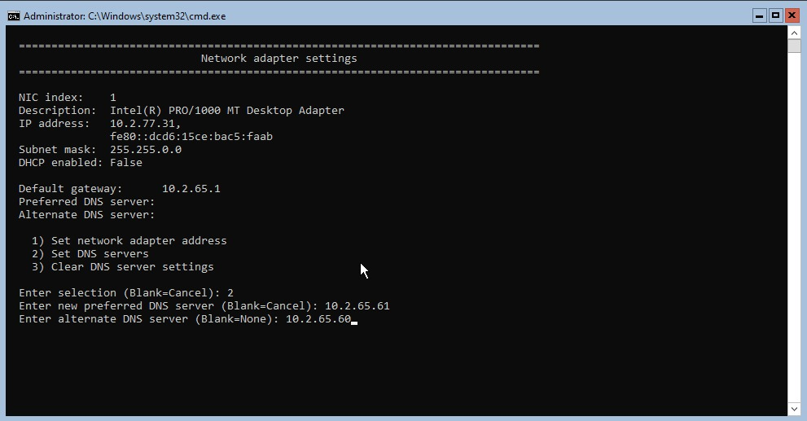

**- Salimos  de la configuracion eligiendo la opcion 15**

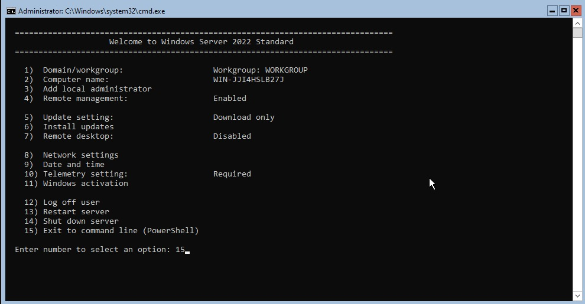

**- Iniciamos las pruebas de ping, empezando por "8.8.8.8"**

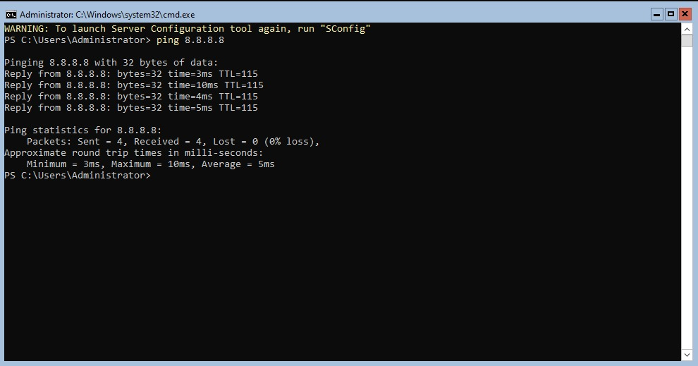

**- Hacemos las pruebas con todos los demas**

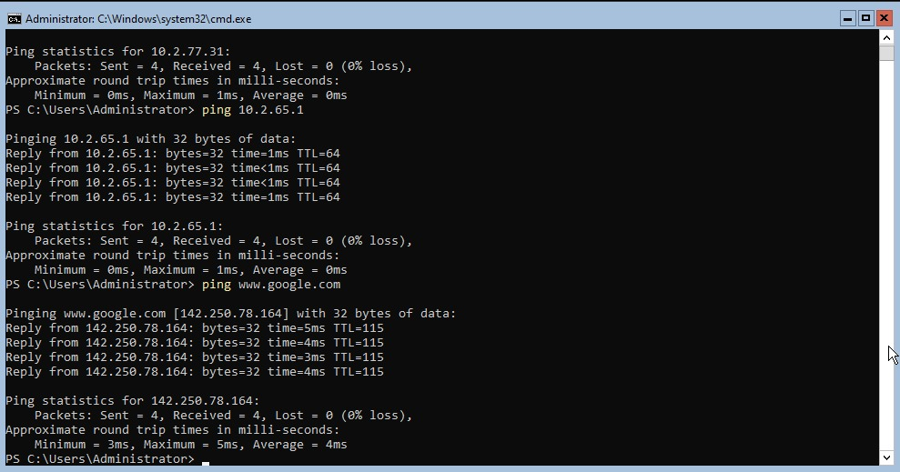

**- Empezamos a agregar los 3 usuarios pedidos**

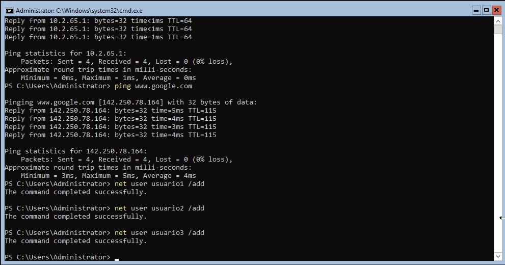

**- Metemos a cada uno en un grupo distinto para que tengan diferentes permisos**

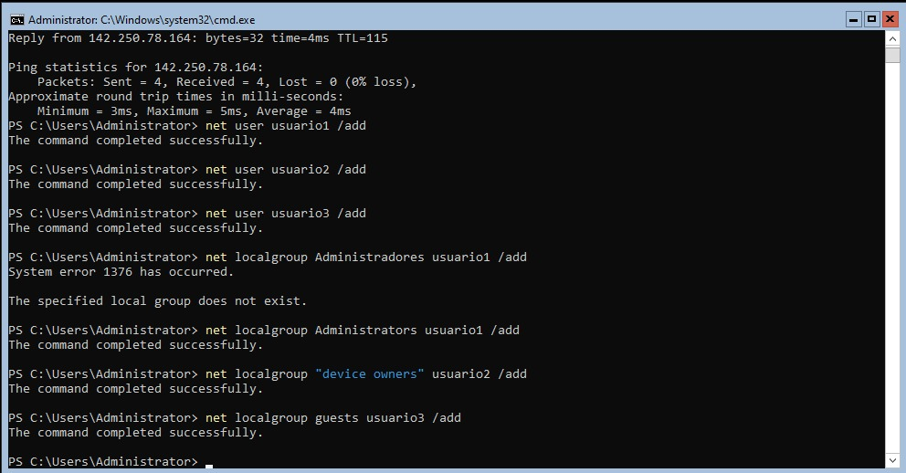

**- Y finalmente confirmamos que cada uno este dentro de su grupo correspondiente**

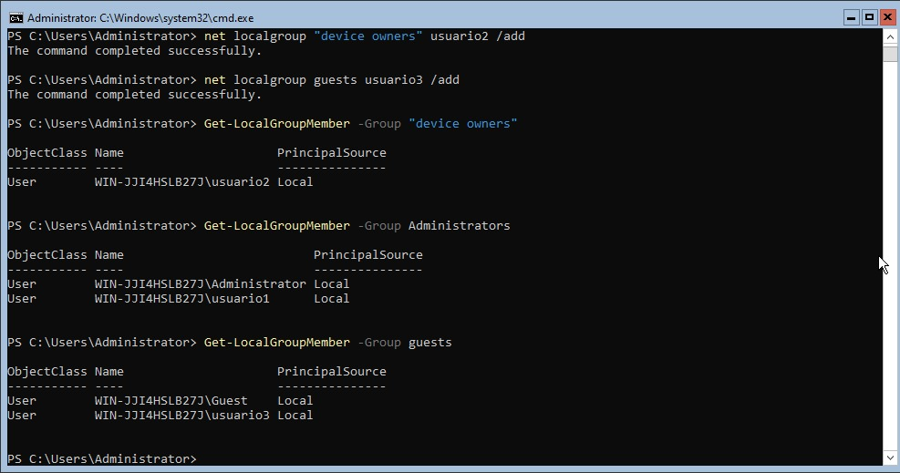

### Maquina #2 (Con interfaz)

**- Igual que ocn la anterior realizamos los primeros pasos de la misma manera**

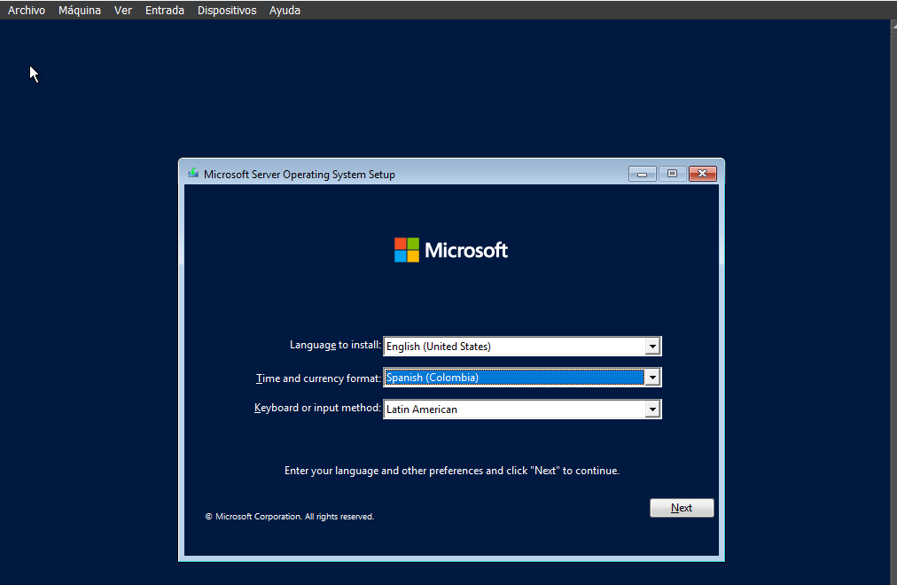

**- En este punto a diferencia de la maquina anterior, seleccionamos "Standard (Desktop Experience)"**

**- Seleccionamos la instalacion "Custom"**

**- Seleccionamos el disco recien creado**

**- Y esperamos la que se termine la instalacion**

**- Iniciamos la configuracion asignando una contraseña para el perfil de Administrador "Root1234"

**- Despues de accerder nos encontramos en el menu**

**- Para poder crear los demas usuarios entramos en configuracion**

**- Luego en "Accounts"**

**- "Other Users"**

**- Le damos en "Add"**

**- Ingresamos a la carpetea de Users**

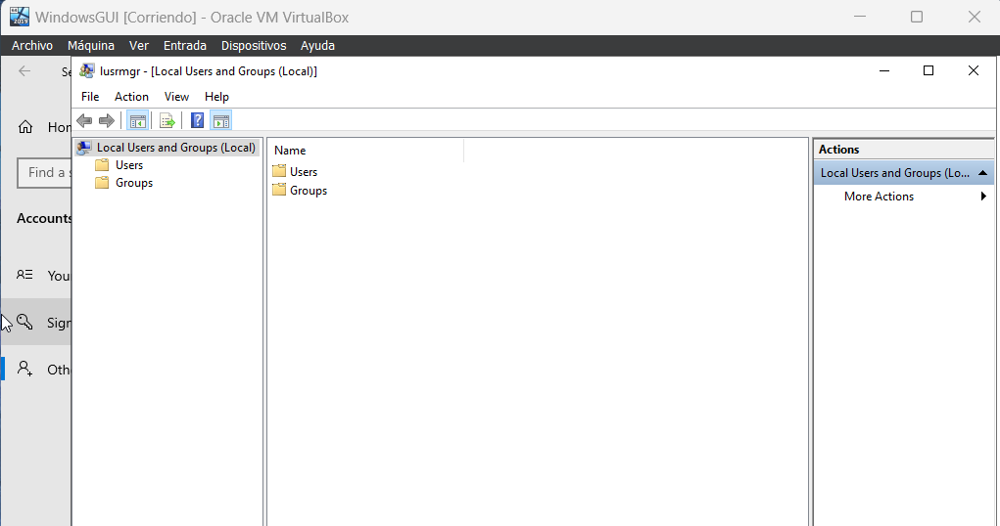

**- Le damos click derecho y en "New User"**

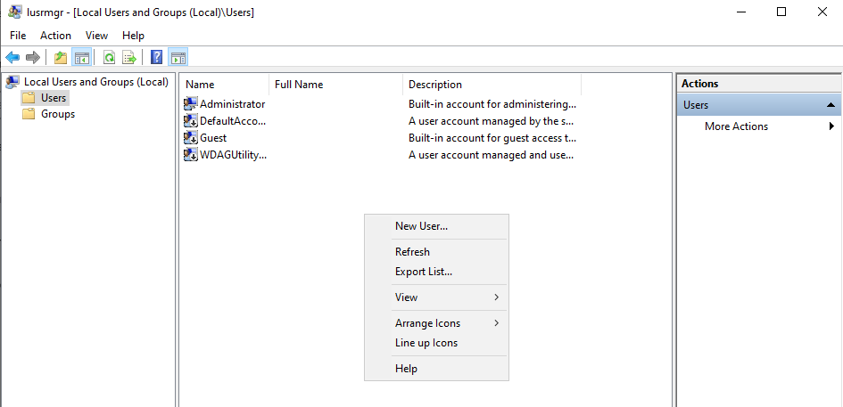

**- Completamos los datos solicitados para cada usuario**

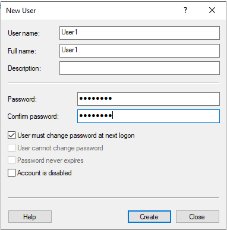

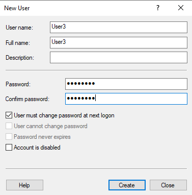

**- Y finalmente verificamos que aparezcan dichos usuarios**

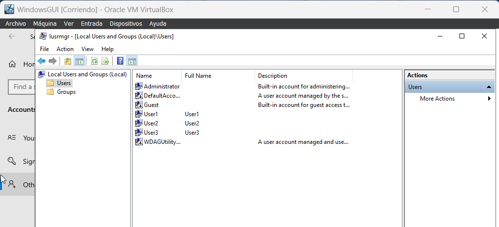

**- En este punto se deberia iniciar la configuracion de red, sin embargo al no estar disponible por el momento lo dejaremos momentaneamente por aqui**
