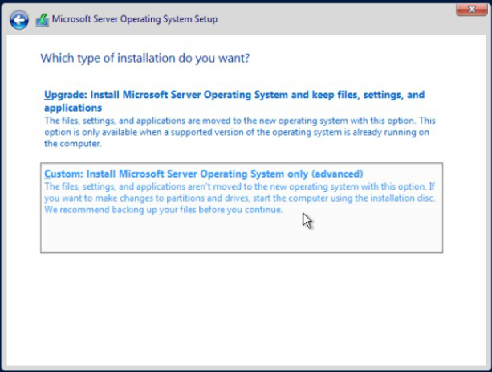

### Creacion de la maquina virtual de Windows
**- Inicamos con una configuracion basica, colocandole su respectivo nombre**

**-Le configuramos un tamaño basico para la ram**

**-Le asignamos 15GB de almacenamiento**

**-Configuramos la red:**

**- Podemos seleccionar el teclado en español colombia**

**- En este caso como se quiere instalar sin interfaz grafica, seleccionamos la version Standard**

**- Aceptamos los terminos**

**- Elegimos la instalacon personalizada**

**- Seleccionamos el disoc recien creado**

**- Esperamos un rato a que instale**

**- Seleccionamos ok para asignarle una contraseña**

**- Digitamos una contraseña "root1234" y le damos ENTER"**

**- Esperamos que inicie**

**- Iniciamos la configuracion de network, por lo cual elegimos la opcion 8**

**- Seleccionamos la opcion 1**

**- Nuevamenete seleccionamos la opcion 1 para configurar la red**

**- Ponemos un "S"**

**- Se escribe la IP dada por el laboratorio**

**- Escribimos la mascara tambien dada por el laboratorio**

**- Y escribimos el "Gateway"**

**- Momentaneamente esta maquina se queda hasta este punto, ya que no contamos con accesos a los computadores de la universidad por el momento**

###Maquina #2 (Con interfaz)

**- Igual que ocn la anterior realizamos los primeros pasos de la misma manera**

